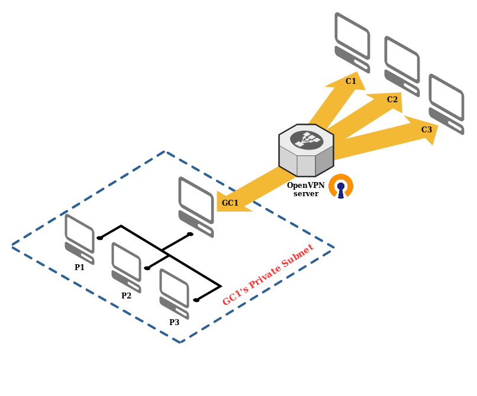

# OpenVPN client-site-to-client routing

This repository contains an OpenVPN docker based setup, where a client (GC - gateway client) exposes his private
subnet to other clients (C1, C2, C3).



It's based on the assumption that GC1 can act as a gateway to its subnetwork, which contains its
peers (P1, P2, P3). When GC1 is connected to the public OpenVPN server, other (normal, non-gateway) clients (C1,
C2, C3) can access GC1s peers (P1, P2, P3).

The project is based on the great OpenVPN docker image from Kyle Manna available
[here](https://github.com/kylemanna/docker-openvpn).


## Prerequisites

 - Enabled IP forwarding on GC1.
 - Installed docker on OpenVPN server machine.

## Quick start

In order to setup your OpenVPN server as the first step adapt the env file. You can easily copy the template
and just replace the default values with those that suit your desired setup.

```
cp .env.template .env
```

In order to setup the docker container and register it as a service on your machine you can directly
run the main script:

```
./run.sh
```

This will also output the Gateway Client OpenVPN profile which you can directly use to connect the
Gateway Client (GC1) to the OpenVPN server. The file will be located under the `output/` directory.

To register other clients that should have access to GC1s private subnetwork you can run:

```
./bin/create-client.sh <YOUR_CLIENT_CN>
```

 The resulting profile file will also be available in the `output/` directory.